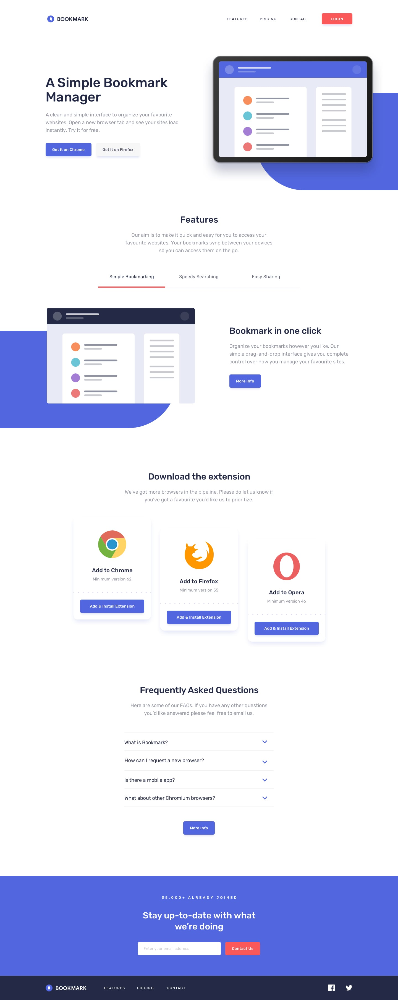

SPANISH V.

## 🌸 Descripción

Este proyecto forma parte de una serie de sprints realizados en IT Academy - Barcelona Activa.

Este Sprint corresponde al 01.2.

El objetivo de este proyecto es crear una página de inicio utilizando Bootstrap y SASS.

### 📖 Mockups




## 💻 Tecnologias usadas

 

 


## ⚙️ Instalación

Para instalarlo en la computadora, debes seguir estos pasos:

1. Clona el repositorio
2. Ingresa en la terminal dentro del proyecto:

```bash
npm install
``` 

## 🔗 Autora

 
Laura G. 
[LinkedIn](https://www.linkedin.com/in/laura-gil-solano/)


_______________________________________________________________________

ENGLISH V.

## 🌸 Description

This project is part of a series of sprints carried out at IT Academy - Barcelona Activa.

This Sprint corresponds to 01.2.

The objective of this project is to create a landing page using Bootstrap and SASS.

### 📖 Mockups


## 💻 Technologies Used

- 
- 
- 
- 

## ⚙️ Installation

To install it on the computer you must follow these steps:

1. Clone the repository
2. Put in the terminal within the project

     ```bash
    npm install
     ```

## 🔗 Author

 
Laura G. 
[LinkedIn](https://www.linkedin.com/in/laura-gil-solano/)
